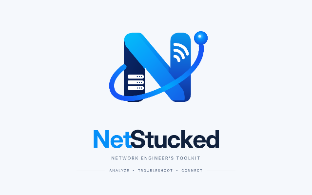

# NetStucked 0.5.0

**0.5.0 Wi-Fi integration:** Network Info now contains the approved compact-table **Wi-Fi Profile Manager** with Native WLAN profile/connect controls, Windows-protected authentication, measured Connect & Test and bounded history. See [usage and limits](docs/WIFI_PROFILE_MANAGER.md) and [Wi-Fi QA](docs/QA_WIFI_2026-10-09.md). Real Wi-Fi hardware authentication remains NOT TESTED on this development machine (WLAN service stopped). The later human request authorizes combining this work with 0.4.2 and publishing 0.5.0. See [combined scope/checklist](docs/FEATURES_0.5.0.md).



Windows 10/11 x64 desktop diagnostics for IP addresses, hostnames and authorized subnets. C# / WPF / .NET 10 / MVVM. Live Ping, continuous ICMP Traceroute and TCP/UDP Port Test use actual network APIs. Light/Dark/System themes, collapsible/resizable panels and shared hop descriptions follow the human-reviewed UI mockup. Port Test continuously scans separate hosts and ports, supports inclusive port ranges and saved/restorable templates, and sends a configurable zero-filled TCP/UDP payload (default 32 bytes, 0–1400). Public WAN descriptions use bounded RIPEstat metadata lookups; UDP silence stays inconclusive. Updates & Recovery retains explicit selected-build installation/recovery with verification, backup and restart. The approved layouts in `design/references/` are preserved; sample telemetry is never loaded.

## Build

Install a .NET 10 SDK, then from the repository root:

```powershell
dotnet restore NetStucked.sln
dotnet build NetStucked.sln -c Release
dotnet test NetStucked.sln -c Release
dotnet run --project src/NetStucked.Desktop
pwsh -File scripts/Publish.ps1
```

Inno Setup 6 is needed only to compile the installer. Preferences/logs are per-user under `%LOCALAPPDATA%\NetStucked`. No administrator privilege or .NET installation is required for the self-contained application. Choose only targets you are authorized to diagnose. ICMP loss does not establish that a remote host or service is offline.

See [0.4.2 stability, copying and optional hop TCP checks](docs/FEATURES_0.4.2.md), [0.4.1 defect fixes and payload behavior](docs/FEATURES_0.4.1.md), [0.4.0 authorized features](docs/FEATURES_0.4.0.md), [selected-build installation/recovery](docs/FEATURES_0.3.0.md), [0.2.0 diagnostics](docs/FEATURES_0.2.0.md), `docs/FEATURE_SPEC.md`, `docs/NETWORK_BEHAVIOR.md` and `docs/DEVELOPMENT.md`. Dashboard, Network Info and background update checks/installations remain deferred.

## Product milestones and current status

The [milestone index](docs/MILESTONE_INDEX.md) consolidates M00–M09, post-stable A01–A09 and On Hold commercial B01–B05. [Implementation status](docs/IMPLEMENTATION_STATUS.md) separates the published 0.4.0 baseline from the 0.4.1 working follow-up and records actual tests/limits. [Roadmap](docs/PRODUCT_ROADMAP.md) reconciles older version proposals with releases; planning does not approve future pages.

Current diagnostic/appearance/update functionality is implemented; required human/remote/clean Windows installer acceptance remains open. The [next Codex task](docs/CODEX_NEXT_TASK.md) closes M00/M07 acceptance and current approved follow-up regressions. Network Info is the next proposed new feature after UI approval. See [vision](docs/PRODUCT_VISION.md), [features](docs/FEATURE_REGISTRY.md), [UI approvals](docs/UI_APPROVAL_REGISTER.md), [dependencies](docs/FEATURE_DEPENDENCIES.md) and [security/data policy](docs/SECURITY_AND_DATA_POLICY.md). This milestone task adds no future feature or release.

## Published versions

- [0.4.1](https://github.com/pk-wrk-sea/NetStucked/releases/tag/v0.4.1) is GitHub Latest, with dark-input/session fixes, improved toolbars, continuous multiple-target Port Test, inclusive port ranges and configurable TCP/UDP payloads. Download its installer or portable ZIP; see the [verified 0.4.1 publication report](docs/GITHUB_RELEASE_0.4.1_REPORT_2026-10-09.md).
- [0.4.0](https://github.com/pk-wrk-sea/NetStucked/releases/tag/v0.4.0) remains available for recovery, with branding, themes, shared hop descriptions and TCP/UDP multiple-target scans. See the [historical publication report](docs/GITHUB_RELEASE_0.4_REPORT_2026-10-09.md).
- [0.3.0](https://github.com/pk-wrk-sea/NetStucked/releases/tag/v0.3.0) is the baseline for selected-build installation/recovery.
- [0.3.1 TEST BUILD](https://github.com/pk-wrk-sea/NetStucked/releases/tag/v0.3.1) exercises Upgrade to 0.3.1 and Recovery to 0.3.0. It changes version metadata and release history only. It uses normal SemVer, explicitly labeled TEST BUILD and not marked Latest, because the checker excludes prereleases.

All current releases have self-contained Windows x64 portable ZIPs, Inno Setup installers, SHA-256 files and manifests. 0.4.2 is the verified GitHub baseline pending 0.5.0 publication; 0.4.0 and the older 0.3.x builds remain available for selected-build recovery. Open Updates, check GitHub and select the desired build. 0.2.x releases/downloads and six older Actions build artifacts were deleted by explicit user instruction after verified local backups; their Git source history/tags remain. The [0.3.x publication report](docs/GITHUB_RELEASE_0.3_REPORT_2026-10-09.md) records historical hashes, CI and actual menu/retirement checks. Installers are unsigned; explicit acknowledgement and Windows prompts remain. Actual machine install/upgrade/uninstall/downgrade remains untested. The [older 0.2.x report](docs/GITHUB_RELEASE_REPORT_2026-10-09.md) is historical evidence.

## Current verification and runnable output

**0.5.0 integration:** Wi-Fi Profile Manager is combined with all 0.4.2 diagnostics fixes. See [scope and manual checklist](docs/FEATURES_0.5.0.md) and [combined QA](docs/QA_0.5.0.md). Source version is 0.5.0; package/publication status will be recorded after exact-package verification. The original Wi-Fi source snapshot is backed up under `artifacts/github-release/0.5.0/wifi-source-snapshot`.

**Historical published 0.4.2:** [Release/downloads](https://github.com/pk-wrk-sea/NetStucked/releases/tag/v0.4.2), [publication evidence and limits](docs/GITHUB_RELEASE_0.4.2_REPORT_2026-10-09.md) and [unchecked human checklist](docs/FEATURES_0.4.2.md#human-acceptance-checklist). 214 tests, exact WPF/native/package checks, simultaneous 254-target Ping / 32-endpoint TCP / two-Traceroute soak and both CI workflows pass. Local frozen output is `artifacts/github-release/0.4.2/final/publish/NetStucked.exe`; keep the directory together. Wi-Fi/planning WIP in the original checkout remains separate and unchanged; use the report's source checkout for this implementation. No machine installer was executed.

The published 0.4.1 output is `artifacts/github-release/0.4.1/final/publish/NetStucked.exe`; keep its full directory together. The [0.4.1 publication report](docs/GITHUB_RELEASE_0.4.1_REPORT_2026-10-09.md) records 196 tests, exact-package checks, immutable asset hashes and verification limits. Earlier output under `artifacts/github-release/0.4.0/final/publish` remains preserved. The [0.4.0 publication report](docs/GITHUB_RELEASE_0.4_REPORT_2026-10-09.md) records exact package hashes, CI, real WPF/loopback/native checks and public installer verification. The original `artifacts/ui-branding/0.4.0/final` package and [local QA](docs/QA_0.4.0.md) remain preserved. No machine installation occurred in this publication task.

The user-requested UI revision includes compact probe dialogs, named address templates, destination history, independent traceroute session tabs, result timestamps, stable manual history scrolling, Fit Columns/resize guide/tooltips, cached navigation, activity indicators and framed monitor-aware window controls. Traceroute polls each known TTL independently; the event log records important changes. Only actual API outcomes populate results. See [the revision report](docs/UI_REVISION_2026-10-08.md) for the implemented behavior and measured validation. Earlier bug-audit and performance packages/reports are preserved as historical evidence.

The original local output is `artifacts/selected-build/0.3.0/final/publish/NetStucked.exe`; keep its full directory together. Release packages are prepared under `artifacts/github-release/0.3.0/final` and `artifacts/github-release/0.3.1/final`. Previous local packages remain preserved, including retired 0.2.x backups under `artifacts/github-release/retired-0.2.x`. The SDK used on this machine is `C:\Users\PK\.codex\cache\netstucked-tools\dotnet\dotnet.exe`; use its full path until .NET 10 is on PATH. The portable application contains its runtime. Checks and installations start only after the user's click.

0.3.0 has 150 passing automated tests, real WPF/ICMP/TCP drain checks, actual GitHub installer download/hash/Windows trust checks and real isolated-helper startup acknowledgement. Its self-contained output and Inno Setup compilation are checked locally; see [0.3.0 QA](docs/QA_0.3.0.md) for precise evidence. Remote multi-hop networking/TCP, human GUI/monitor-DPI/accessibility acceptance, Windows 11 and actual install/upgrade/uninstall/downgrade remain **NOT TESTED**.
