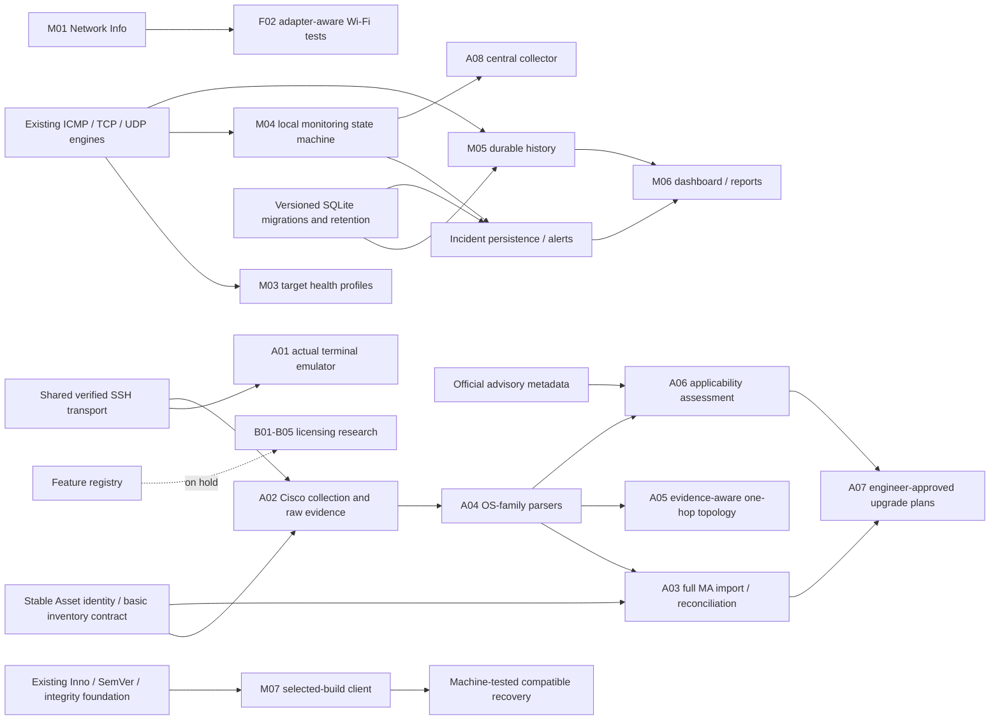

# Feature dependencies

Solid arrows describe required capabilities, not permission or a requirement to finish every preceding UI. All future modules/interfaces below are **proposed**, absent from current production code.

Current production ownership remains Core contracts/scheduling, Infrastructure network/Windows/persistence, Desktop presentation/DI. Propose narrow interfaces for `IHistoryStore`, `IIncidentStore`, `INetworkContextSource`, `IWlanProfileService`, `ISshTransport`, `IRawEvidenceStore`, `IDeviceParser`, `IAssetStore`, `ITopologyEvidenceSource`, `IAdvisorySource` and `IUpgradePlanStore` only when the corresponding milestone is authorized. They are not implemented now.

Avoid circular dependencies: Collector records stable Asset IDs plus raw observed facts; inventory reconciliation is a separate approval-aware consumer. Parsing consumes raw collection records. Topology and CVE consume versioned fact/evidence contracts; neither invokes the other. Upgrade plans consume reviewed assessments and inventory, never execute device upgrades in this scope. Collection is reusable by Terminal but does not require terminal UI/emulation.

History should accept session/probe identifiers without running network calls on its writer. Monitoring can initially retain bounded incidents, but persistent incident acceptance needs the M05-compatible store contract. Before SQLite is shipped, M07 must gain explicit schema migration/downgrade coverage; current schema-1 JSON compatibility does not prove future database rollback.
